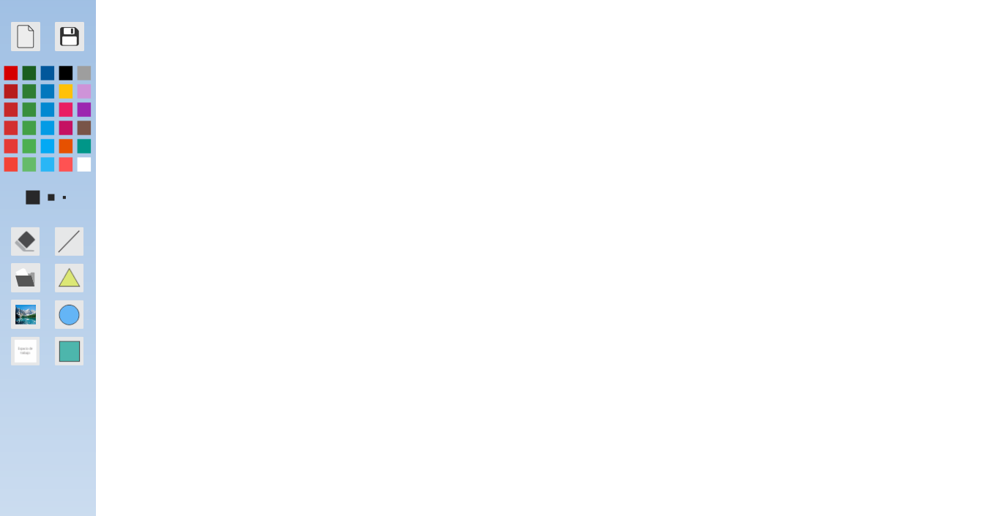

# Paint
Paint 

Basic drawing software.
Features:
- Color palette.
- Eraser. 
- Painting pen size.
- Save drawings (.JPG).
- Basic geometric shapes: Line, triangle, circle, square, rectangle.
- Edit a Picture (.JPG)
- Resize workspace.
- New workspace.

